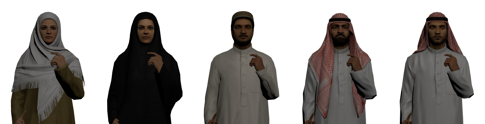
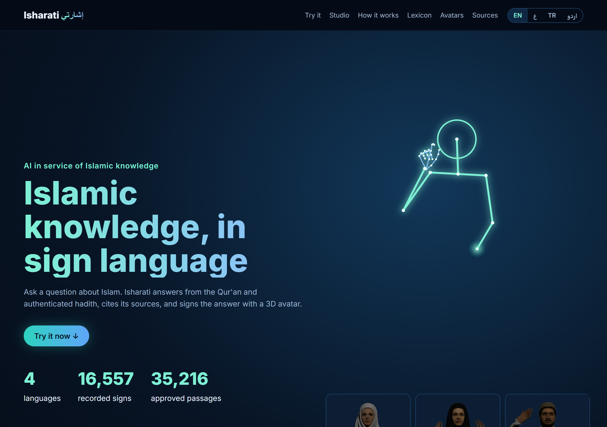
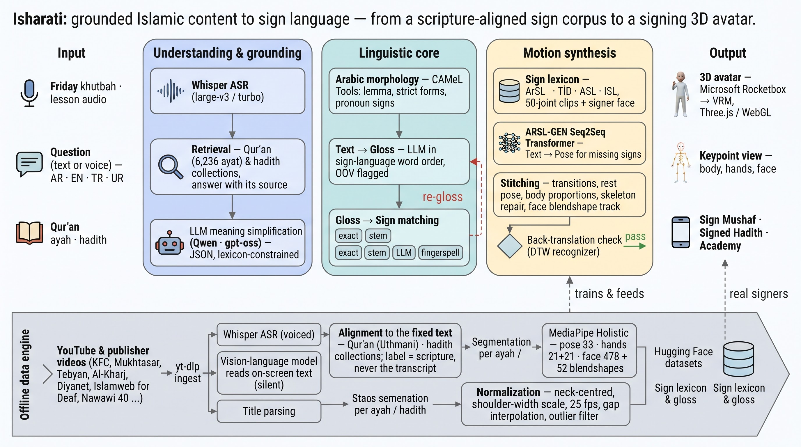
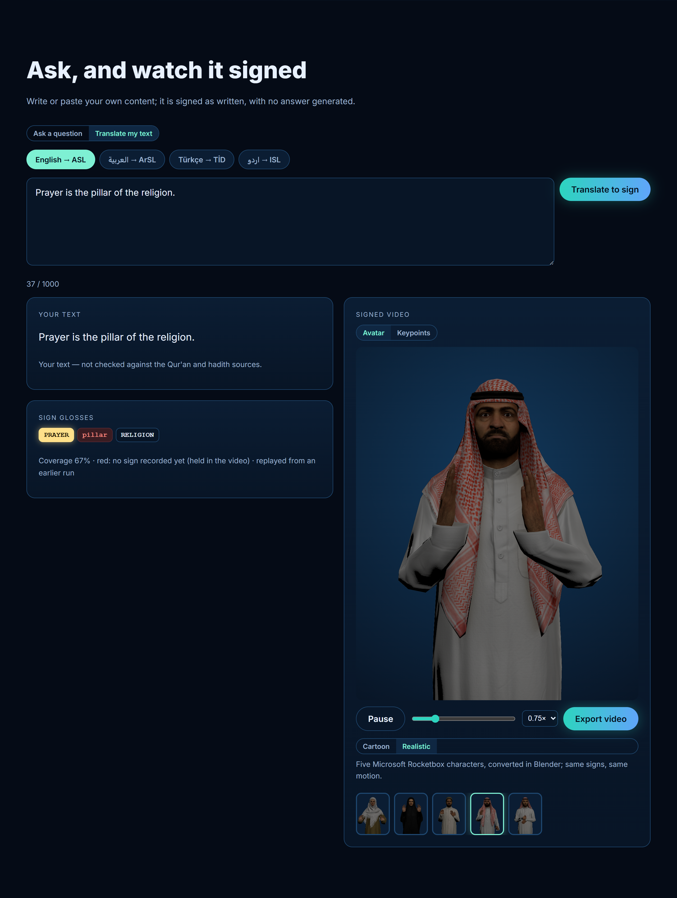
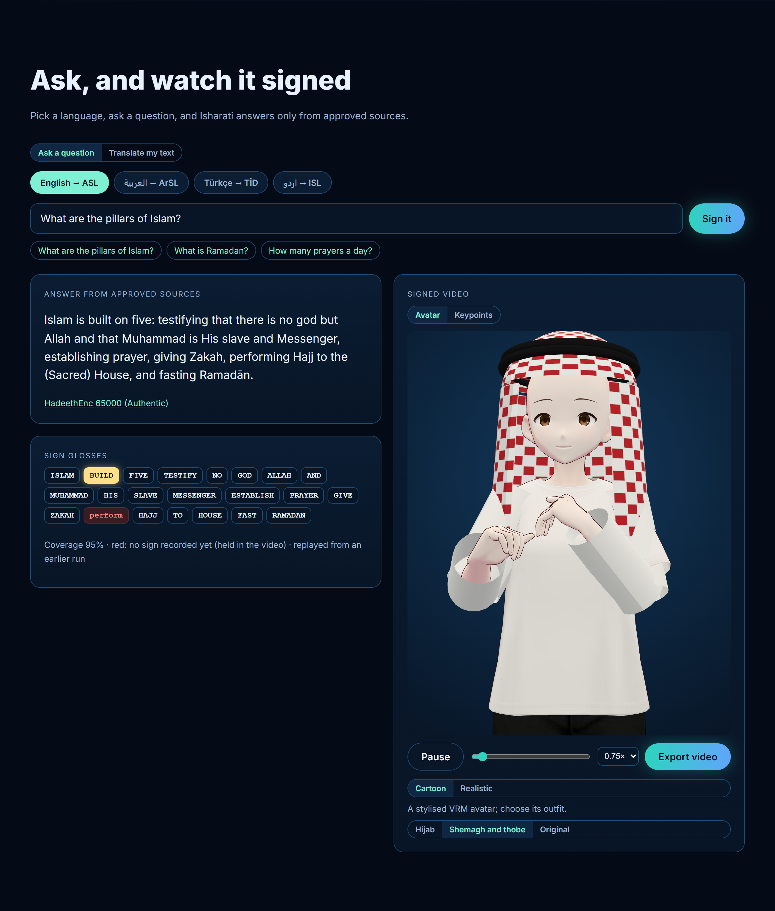
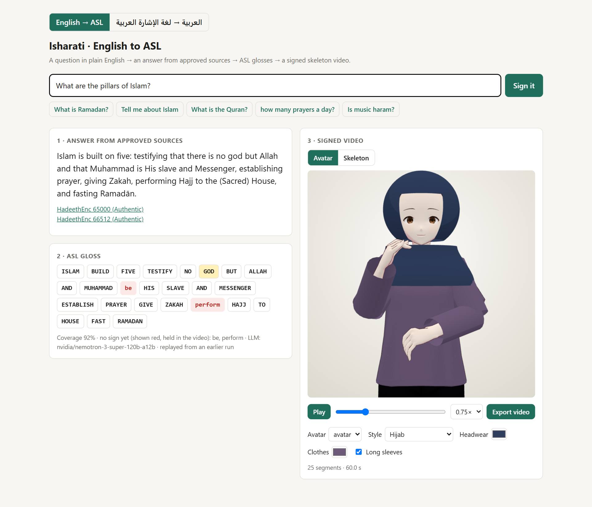
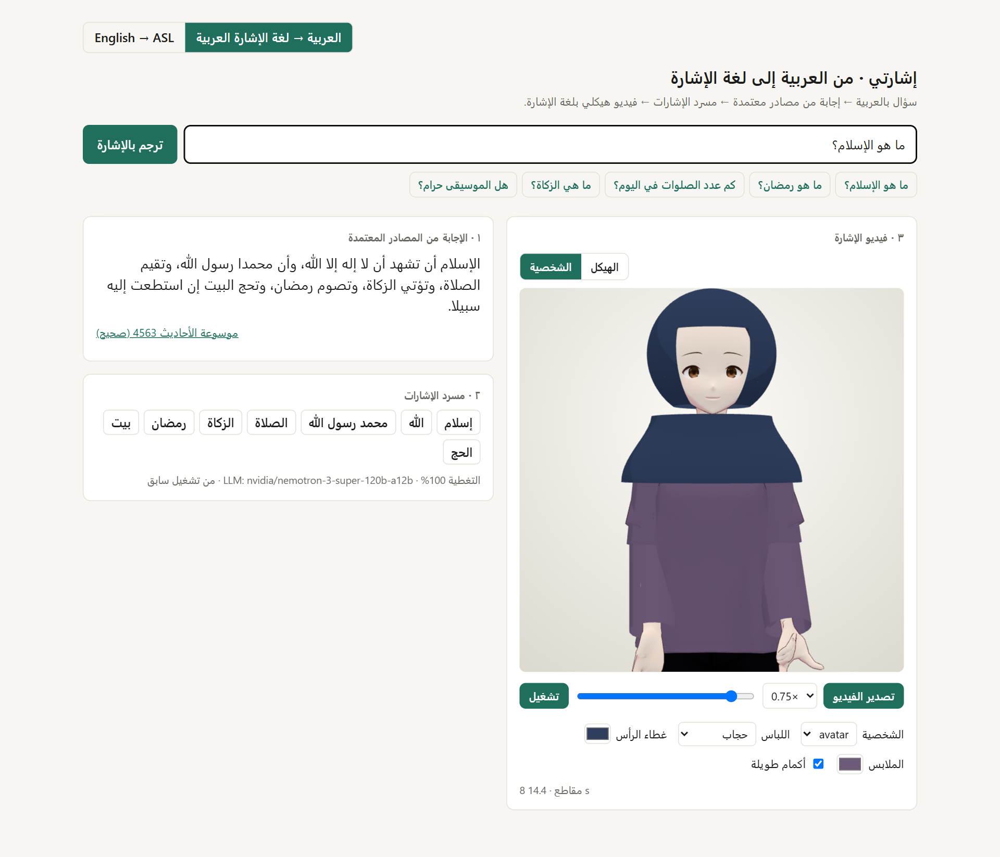

<div align="center">

# Isharati · إشارتي

**Answers about Islam from the Qur'an and authenticated hadith, signed in American, Arabic, Turkish and Indian Sign Language.**





[-1E3A5F)](docs/paper/main.pdf)
[](https://huggingface.co/spaces/FatimahEmadEldin/isharati-app)
[](https://huggingface.co/collections/FatimahEmadEldin/quran-in-sign-language-6abf892cb1940477ad57971b)
[](https://huggingface.co/collections/FatimahEmadEldin/hadith-in-sign-language-6ac3f8c150af9e5417c0d93d)
[](https://huggingface.co/datasets/FatimahEmadEldin/isharati-data)
[](https://youtu.be/MhDm_XLl8fI)
[](LICENSE)

</div>

---

## The problem

More than 70 million deaf people use a sign language as their first language. For many deaf Muslims, the Qur'an and the
hadith reach them only through a written second language, and the signed Islamic content that exists is scattered across
short videos without sources. The Bible already exists as a machine-learning corpus in 98 sign languages
([JWSign](https://aclanthology.org/2023.findings-emnlp.664/)); we found no aligned Qur'an or hadith corpus in any sign
language, so we built one (see [Signed Qur'an and hadith](#signed-quran-and-hadith)).

Religious content adds two requirements that general sign-generation systems do not meet: an answer must not add facts
to what the Qur'an and the Sunnah say, and Islamic terms (*salah*, *zakah*, محمد رسول الله) must be shown with their
established signs, not spelled letter by letter.

## Architecture



## What it does

A question in English, Arabic, Turkish or Urdu goes through five stages, and the run stops with an explicit status rather than a doubtful
answer:

1. **Ruling pre-check.** Questions that ask for a fatwa are referred to scholars, before any model is called.
2. **Hybrid retrieval.** BM25 and multilingual-E5 embeddings, fused by reciprocal rank, search 6,236 verses and
   2,150–3,574 HadeethEnc hadith per language.
3. **Grounded answer.** An LLM writes 2–4 cited sentences. A sentence is kept only if 80% of its content words occur in
   the passages it cites, and a sentence that cites only Qur'an verses must reproduce a verse's wording.
4. **Glossing.** An LLM turns the answer into sign glosses, restricted to the sign lexicon. Arabic matching uses
   morphological analysis (clitics, plurals, CAMeL lemmas) and reviewed synonyms (for example «سبيل» → «طريق»). Words
   without a sign are reported, never fingerspelled.
5. **Signing.** The recorded signs are joined into one pose sequence, shown as a skeleton video or on a 3D avatar, at
   adjustable speed, with video export. Viewers choose an avatar:
   - five realistic avatars converted from [Microsoft Rocketbox](https://github.com/microsoft/Microsoft-Rocketbox) (MIT),
     already in modest dress: a woman in a white hijab, a woman in a black abaya, and men in a thobe with cap, with a
     red shemagh, and with a white shemagh;
   - a stylised avatar with hijab or shemagh-and-thobe outfits added on top.

The app also has an **Academy**: the Arabic alphabet in sign, and the signed Qur'an and hadith per language, played on
the same avatars.

The page has two modes:

- **Ask a question.** The full pipeline above: sources, a cited answer, glosses and the signed video.
- **Studio (Translate my text).** Your own text is glossed and signed as written, with no answer generated and no source
  check, so the page says it is not checked against the Qur'an and hadith.

 

 

## Sign lexicons and coverage

Coverage is the share of content-word occurrences (tokens) in the Qur'an and hadith corpus that have a recorded sign
(`scripts/eval/corpus_eda.py`, output in `results/eda.json`; the landing page reads the same figures from
`src/isharati/app/static/stats.json`). A word counts as covered when it, its lemma or a reviewed synonym has a sign.
Fingerspelling is **not** counted: every word can be spelled, so counting it would make every language 100% and say
nothing about whether the meaning is signed.

| Question language | Sign language | Signs (entries) | Distinct glosses | Passages | Qur'an | Hadith | **All** |
|---|---|---|---|---|---|---|---|
| English | ASL | 3,677 | 3,677 | 8,564 | 86.9% | 82.3% | **83.1%** |
| Turkish | TİD | 4,827 | 4,491 | 8,386 | 75.4% | 75.7% | **75.7%** |
| Urdu | ISL · PSL | 10,233 | 8,402 | 8,456 | 72.4% | 72.0% | **72.1%** |
| Arabic | ArSL | 6,662 | 6,614 | 9,810 | 60.0% | 69.4% | **68.4%** |

Urdu signs by source: CISLR 3,965, WSLP 4,056, ISLRTC 966, PSL 1,246 (Urdu coverage is measured on the English glosses).

**Arabic at 68%, and the way to ~80%.** A word counts as covered when it, its lemma or a reviewed synonym has a sign,
or when it is part of a phrase sign the text contains word for word («صلى الله عليه وسلم», «عز وجل», «أبو هريرة»), as
the glosser uses them. Reviewed mappings close most of the gap so far: the negation «لا» to the curriculum's «ليس»,
«بن» to «ابن», 112 verbs recorded in their dictionary form («يكتب») reached from every conjugation («كتبوا», «فكتب»),
and a verb reading preferred over a doubtful clitic split («فتحت» is *she opened*, not *and under*). The most frequent
words still unsigned are «قبل», «الدنيا», «شيء», «مثل», «المؤمنين», «آمنوا» and the companions' names (هريرة، عباس،
بكر، عمرو), which a few recorded signs or name signs would close.

Each synonym is reviewed before it is added (`src/isharati/lexicon/synonyms_ar.json`), because a wrong synonym signs the
wrong meaning in a religious text.

**Text to gloss against the ArabSign gold glosses** (25 held-out sentences): gloss WER **0.52–0.55** over three runs,
recall 61–64%.

**Not yet verified.** No sign has been reviewed by Deaf signers for this project. Details and the full evaluation are in
the [technical report](docs/paper/main.pdf).

## Signed Qur'an and hadith

Continuous signing, aligned to the fixed text. Every label is the Qur'an or the hadith as printed, never a transcript.
Each sample has Isharati poses `[T,50,3]` at 25 fps (MediaPipe Holistic, aspect-corrected, despiked), face contour points
and, for the hadith, the signer's 52 face blendshape scores. No video is uploaded: the videos belong to their publishers.

**[Qur'an in sign language](https://huggingface.co/collections/FatimahEmadEldin/quran-in-sign-language-6abf892cb1940477ad57971b)** (Hugging Face collection)

| Dataset | Source | Sign language | Segments | Distinct ayahs | Surahs | Hours |
|---|---|---|---|---|---|---|
| [`quran-sign-kfc`](https://huggingface.co/datasets/FatimahEmadEldin/quran-sign-kfc) | King Fahd Glorious Qur'an Printing Complex, translation of the meanings | ArSL | 1,066 | 558 | 38 | 7.4 |
| [`tafsir-mukhtasar-sign`](https://huggingface.co/datasets/FatimahEmadEldin/tafsir-mukhtasar-sign) | al-Mukhtasar fi Tafsir al-Qur'an al-Karim | ArSL | 6,127 | 5,916 | 112 | 34.7 |
| [`quran-sign-curriculum`](https://huggingface.co/datasets/FatimahEmadEldin/quran-sign-curriculum) | Al-Kharj school Qur'an curriculum | ArSL | 207 | 186 | 22 | 0.3 |
| [`quran-sign-tebyan`](https://huggingface.co/datasets/FatimahEmadEldin/quran-sign-tebyan) | Tebyan Qur'an, per-ayah videos | ArSL | 567 | 570 | 38 | 2.4 |
| [`quran-sign-diyanet-tid`](https://huggingface.co/datasets/FatimahEmadEldin/quran-sign-diyanet-tid) | Diyanet İşleri Başkanlığı | TİD | 13 | 12 | 2 | 0.1 |
| **Total** | | | **7,980** | | | **44.9** |

**[Hadith in sign language](https://huggingface.co/collections/FatimahEmadEldin/hadith-in-sign-language-6ac3f8c150af9e5417c0d93d)** (Hugging Face collection)

[`hadith-sign`](https://huggingface.co/datasets/FatimahEmadEldin/hadith-sign) is built from 824 YouTube videos by Deaf
associations and Islamic channels. The speech is transcribed (Whisper large-v3-turbo) and matched to the
[hadith-api](https://github.com/fawazahmed0/hadith-api) corpus with a rare-bigram index and ordered alignment; silent
videos are labelled from on-screen text or titles and verified against the corpus. Only labelled samples are
published, with jitter smoothed (0.2 s) and unusable skeletons left out:

| Samples | Distinct hadith | Hours | ArSL | TİD |
|---|---|---|---|---|
| 375 | 301 | 15.5 | 357 | 18 |

| Source | Samples |
|---|---|
| القناة التعليمية للصم: شرح عمدة الأحكام بلغة الإشارة | 145 |
| Islamweb for Deaf: الحديث الشريف بلغة الإشارة | 99 |
| جمعية إنسان: الأربعون النووية بلغة الإشارة | 50 |
| القناة التعليمية للصم: رياض الصالحين | 21 |
| Eray Demir: İşaret Dili ile 40 Hadis | 18 |
| القناة التعليمية للصم: شرح 30 حديثاً للنساء | 17 |
| mahmoud hafez: الأربعين النووية بلغة الإشارة | 15 |
| حمزة ودويد للصم: الأحاديث | 8 |
| أحاديث متفرقة بلغة الإشارة | 2 |

## Data

The code repository carries no data. Everything the app reads is on the Hugging Face Hub, each source with its
attribution and licence in the dataset card, and the server downloads it on first use:

| Dataset | Content |
|---|---|
| [`isharati-data`](https://huggingface.co/datasets/FatimahEmadEldin/isharati-data) | Corpora (Qur'an, HadeethEnc) and sign lexicons, one folder per language |
| [`isharati-app-data`](https://huggingface.co/datasets/FatimahEmadEldin/isharati-app-data) | Academy alphabet (Diyanet) and the Qur'an text (Tanzil, CC BY 3.0), served at `/api/quran/text` |
| [`youtube-asl-isharati`](https://huggingface.co/datasets/FatimahEmadEldin/youtube-asl-isharati) | YouTube-ASL keypoints (CC BY 4.0) in the Isharati pose format |
| The two collections above | Signed Qur'an and hadith |

The datasets are private because several sources do not allow redistribution; access is granted on request for research.

Sources:
- **Qur'an:** the IslamicEval 2025 canonical Uthmani text, the Tanzil text, and the QuranEnc translations.
- **Hadith:** HadeethEnc, with grades and scholarly explanations; the fawazahmed0 hadith-api collections for the signed corpus.
- **Signs:** 21 sources, including ASL Citizen, WLASL, KArSL, Tawasol, the unified Arabic dictionary, the TİD dictionary,
  CISLR, WSLP, ISLRTC and PSL.

The licence of each source is in its dataset card and in the report's Declarations chapter.

## Repository layout

```
src/isharati/
  pipeline.py        question -> answer -> glosses -> pose -> video, with a per-word report
  config.py · hub.py data location; download of the dataset on the Space
  app_data.py        Academy and Qur'an-text files, fetched from isharati-app-data
  llm.py             model clients: OpenRouter, NVIDIA NIM, Groq, with fallbacks
  text/              normalisation and morphology: arabic, arabic_morph, english, levels
  retrieval/         engine (BM25 + E5, grounding checks), arabic, turkish_urdu
  glossing/          LLM glossers for ASL and ArSL, restricted to the lexicon
  lexicon/           lexicons, reviewed synonyms (synonyms.json, synonyms_ar.json), builders
  pose/              keypoints, DTW, body proportions, assembly, skeleton rendering
  backtranslate.py   DTW recogniser for the back-translation check
  app/               FastAPI server, web page, avatars (VRM), retargeting and outfit code (three.js + three-vrm)
web/                 React landing page and Academy (Vite + TypeScript); builds to web/dist
scripts/
  web/               end-to-end browser check and screenshots
  avatars/           Rocketbox FBX -> VRM 1.0 conversion, elbow check
  academy/           Arabic alphabet clips
  corpora/           passage embeddings (multilingual-E5)
  lexicon/           building the sign lexicons: asl/, arsl/, isl/, youtube_dictionaries.py
  eval/              coverage, corpus EDA, ArabSign gloss WER, sign-dataset QA
  mining/            sign spotting in YouTube-ASL (motion matching, weakly supervised MIL)
  hub/               publish the datasets, deploy the Space
notebooks/           YouTube-ASL keypoints -> Google Drive -> Hugging Face (Colab)
deploy/space/        Dockerfile and card of the Hugging Face Space
docs/paper/          technical report (LaTeX source, figures, PDF)
docs/figures/        architecture figure
results/             evaluation outputs (JSON and Markdown)
tests/
```

## Getting started

```bash
git clone https://github.com/astral-fate/isharati-signs && cd isharati-signs
python -m venv .venv && .venv/Scripts/pip install -e .[dev]     # Windows; use .venv/bin on Linux/macOS
cp .env.example .env                                             # then fill in your keys (below)
.venv/Scripts/python -m pytest -q
```

**Keys.** [`.env.example`](.env.example) lists every setting, what it is for and where to get each key; the app reads
`.env` from the project root at start-up. The minimum is a Hugging Face token and one language-model key:

| Variable | Used for | Where to get it |
|---|---|---|
| `OPENROUTER_API_KEY` | the answer and the glosses (what the live demo uses) | [openrouter.ai/keys](https://openrouter.ai/keys) |
| `NVIDIA_API_KEY` | the same, through NVIDIA NIM, when `ISHARATI_LLM` is not `openrouter` | [build.nvidia.com](https://build.nvidia.com) → a model → *Get API Key* |
| `GROQ_API_KEY` | Whisper speech-to-text (audio / video mode) and the last fallback model | [console.groq.com/keys](https://console.groq.com/keys) |
| `HF_TOKEN` | downloading the datasets; question embeddings (`ISHARATI_EMBED=hf`) | [huggingface.co/settings/tokens](https://huggingface.co/settings/tokens) (type *Read*) |
| `DATABASE_URL` | optional: the Review Studio database | [console.neon.tech](https://console.neon.tech) → connection string |

The datasets are private (several sign sources do not allow redistribution): ask the authors for access, and your own
read token works. Then restore the data into `data/`:

```bash
python -c "from isharati import hub; hub.ensure_data()"
```

Ask a question from the command line (settings from `.env`):

```bash
python -m isharati.pipeline "What are the pillars of Islam?"
python -m isharati.pipeline --lang ar "ما هو الإسلام؟"
```

Run the web app (a React page in `web/`, served by the FastAPI app):

```bash
PYTHONPATH=src python -m isharati.app.server     # API + built page on http://127.0.0.1:8765
cd web && npm install && npm run dev             # front-end development on http://localhost:5173 (proxies the API)
cd web && npm run build                          # production build to web/dist, served by the app at /
```

With the app running, `py scripts/web/e2e.py [--live]` checks the page in a browser (Playwright) and rewrites the
screenshots in `docs/paper/figures/` (only when every check passes).

## Deployment

The live demo is a Docker Space with three parts:
- **Data:** downloaded from `isharati-data` and `isharati-app-data` at start-up.
- **Models:** called through OpenRouter (paid `qwen/qwen3.8-27b`, then `qwen/qwen3.8-flash`, then free fallbacks). The
  order is `OPENROUTER_MODELS` in `src/isharati/llm.py`, and can be overridden with `ISHARATI_MODELS`.
- **Question embeddings:** Hugging Face inference of the same E5 model.

```bash
python scripts/hub/publish.py            # data -> datasets/<user>/isharati-data (private)
python scripts/hub/publish_app_data.py   # Academy and Qur'an text -> datasets/<user>/isharati-app-data (private)
python scripts/hub/deploy_space.py       # app  -> spaces/<user>/isharati-app (private); --update to redeploy
```

The deploy script sets the Space secrets `HF_TOKEN` and `OPENROUTER_API_KEY` and the variable `ISHARATI_HUB_DATASET`. It
never overwrites an existing Space unless you pass `--update`.

## Licensing notes

- The demo clips and hero pose (`web/public/clips/`, `web/src/assets/hero-pose.json`) are rendered from lexicon signs
  that include ASL Citizen (non-commercial) and sources whose permission is still being requested (GDM Islamic signs,
  the Qur'an curriculum, the TİD dictionary). They are shown for demonstration only.
- `ISHARATI_URDU_WSLP` is on in the demo; Urdu coverage is measured with WSLP on.

## Adding an avatar

Any VRM 1.0 model placed in `src/isharati/app/static/` appears in the avatar picker. To convert another Rocketbox
avatar, install Blender and the [VRM Add-on for Blender](https://github.com/saturday06/VRM-Addon-for-Blender), then run:

```bash
blender --background --python scripts/avatars/rocketbox_to_vrm.py -- <Rocketbox avatar folder> src/isharati/app/static/rocketbox_<name>.vrm
```

## Demo video

[](https://youtu.be/MhDm_XLl8fI)

Watch on YouTube: https://youtu.be/MhDm_XLl8fI

## Citation

```bibtex
@techreport{isharati2026,
  title       = {Isharati: Grounded Sign Language Generation for Islamic Content},
  author      = {Emad Eldin, Fatimah and Al-Mirghani, Asmaa},
  institution = {Bathel AI Challenge 2026: Serving Islamic Content},
  year        = {2026},
  url         = {https://github.com/astral-fate/isharati-signs}
}
```

## License

The code is released under the [MIT License](LICENSE). The avatars keep their own licences
([third-party notices](THIRD_PARTY_NOTICES.md)). The data keeps the licence of each source; several sources do not
allow redistribution, so the datasets are private. The application answers only from cited sources and refers questions
that ask for a religious ruling to scholars.
