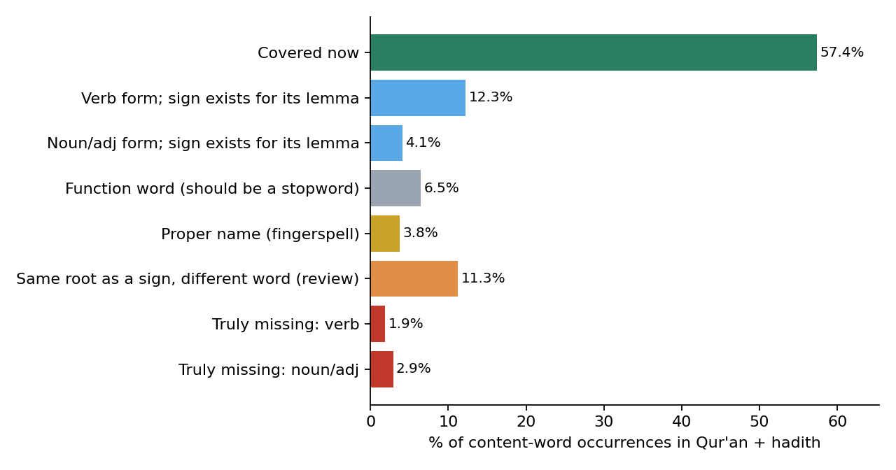

# Arabic lexicon: what is missing from the Qur'an and hadith, and why

*Isharati EDA, 2026-10-05. Lexicon: `lexicon_qa.jsonl` (6,632 signs, 6,602 distinct glosses). Corpus: Qur'an + hadith, 595,022 content-word occurrences (stopwords excluded).*

## Bottom line

The headline **57.4 %** is *not* "57 % of our glosses". It is the share of **every content-word occurrence in the Qur'an and hadith** that the matcher links to a sign. Only **4.8%** of those occurrences are words we truly have no sign for. Most of the uncovered 42.6 % are words **we already sign**, written in a form the matcher does not recognise:

| Why a word is counted as uncovered | Share of all content words | Examples |
|---|---|---|
| Verb form, and its lemma has a sign (يقول → قال) | **12.3%** | وسلم (12,493)، قالت (842)، يكون (813)، قالوا (646)، وجل (570)، كانوا (554)، قلت (486)، كنت (477) |
| Noun/adjective form, and its lemma has a sign | **4.1%** | بن (3,936)، شيء (1,071)، مثل (607)، انما (488)، ربك (337)، يده (293)، يديه (261)، بيده (249) |
| Function word missing from the stopword list | **6.5%** | عنه (3,746)، الا (3,728)، ولا (3,389)، به (2,443)، انه (2,154)، منه (1,259)، فلا (1,069)، عنهما (951) |
| Proper name (fingerspell, or a name sign) | 3.8% | شييا (682)، عباس (495)، المومنين (391)، عمرو (288)، مسعود (265)، جبريل (258)، زيد (199)، المومن (184) |
| Same root as a sign, different word (needs review) | 11.3% | هريره (890)، قبل (846)، بكر (663)، عز (569)، روايه (419)، قوله (405)، الصحابه (395)، دون (338) |
| **Truly missing: verb** | **1.9%** | اخذ (245)، حصل (112)، فاخذ (107)، ينبغي (100)، يحصل (97)، عروه (88)، افلا (84)، ياخذ (71) |
| **Truly missing: noun/adjective** | **2.9%** | الدنيا (730)، سبيل (420)، عذاب (268)، الابل (158)، العذاب (144)، شيت (140)، حاجه (94)، الدجال (88) |

## Why this happens

1. **Verbs are matched only in their exact form.** The matcher deliberately refuses to lemmatise anything that can be read as a verb (a guard so that «وتكفر», *expiates*, cannot become «كفر», *disbelief*). As a result «يقول، قالت، قالوا، فقال، قلت» all miss the sign «قال», even though in ArSL the person and tense are not separate signs: «يقول» is signed as قال, with هو only when needed.
2. **Noun forms with clitics or other inflections are missed**: «ربك، ربنا، ربه» (our sign: رب), «يده، يديه، بيده» (يد).
3. **The stopword list has 60 words**, so function words such as «عنه، إلا، ولا، به، أنه، منه، فلا، إليه» count as uncovered content words, which inflates the denominator.
4. **Phrases**: «وسلم» and «وجل» come from the fixed formulas «صلى الله عليه وسلم» and «عز وجل», which should be phrase signs.

## What fixing it is worth

| Change | Coverage |
|---|---|
| Now | **57.4%** |
| + lemma matching for verbs and nouns whose lemma has a sign | **73.7%** |
| + function words moved to the stopword list | **78.8%** |
| + proper names fingerspelled | **82.8%** |

The "same root" group (11.3%) is **not** counted, because a shared root does not mean a shared meaning (قبل *before* vs قَبِل *accepted*; عز). It needs review word by word.

The verb fix keeps a meaning guard: a verb form maps to a sign only when the sign's gloss is **itself that verb** (same CAMeL lemma, verb reading). So «يقول» → قال is allowed, but a noun sign never absorbs an unrelated verb.

## The words to record next (truly missing, by lemma frequency)

| # | Lemma | Occurrences | Forms seen |
|---|---|---|---|
| 1 | اخذ | 1,260 | اخذ، فاخذ، ياخذ، اخذه، فخذه، اخذت |
| 2 | دنيا | 797 | الدنيا، والدنيا، دنياه، دنيا، للدنيا، بالدنيا |
| 3 | عذاب | 610 | عذاب، العذاب، عذابا، بعذاب، عذابي، وعذاب |
| 4 | سبيل | 556 | سبيل، السبيل، سبيلا، سبيله، السبل، سبيلي |
| 5 | ظن | 346 | ظن، الظن، يظن، اظن، ظنا، ظنه |
| 6 | حاجه | 333 | حاجه، حاجته، الحاجه، لحاجه، لحاجته، حاجتها |
| 7 | صوت | 322 | صوته، صوت، الصوت، صوتا، بصوت، صوتك |
| 8 | حصل | 309 | حصل، يحصل، تحصل، وحصل، حصلت، فحصل |
| 9 | لعل | 250 | لعلكم، لعلهم، لعله، لعل، ولعل، فلعله |
| 10 | ٱتخذ | 238 | اتخذ، اتخذوا، يتخذ، تتخذوا، اتخذها، واتخذوا |
| 11 | كفي | 233 | وكفي، كفي، يكفي، يكفيك، يكفيه، ويكفي |
| 12 | ابل | 224 | الابل، ابل، ابله، ابلي، والابل، ابلا |
| 13 | نفع | 222 | ينفع، نفعا، ينفعه، نفعه، نفع، النفع |
| 14 | خشي | 218 | خشيه، يخشي، خشيت، خشي، اخشي، يخشون |
| 15 | غلام | 196 | الغلام، غلام، غلاما، بغلام، غلامه، غلامك |
| 16 | اثم | 189 | اثم، الاثم، اثما، اثمه، والاثم، بالاثم |
| 17 | ادرك | 189 | ادرك، يدرك، ادركه، يدركه، ادركت، فادركته |
| 18 | قبض | 171 | قبض، قبضه، يقبض، يقبضه، فيقبض، فتقبض |
| 19 | غنم | 169 | الغنم، غنم، والغنم، غنما، غنمه، غنمتم |
| 20 | لفظ | 155 | لفظ، اللفظ، بلفظ، ولفظ، الفاظ، لفظه |
| 21 | كف | 153 | كفه، كف، كفيه، وكف، الكف، فكف |
| 22 | ٱنبغي | 142 | ينبغي، فينبغي، وينبغي |
| 23 | عذب | 141 | يعذب، عذب، يعذبون، يعذبهم، ويعذب، عذبه |
| 24 | شيت | 140 | شيت |
| 25 | زمان | 139 | الزمان، زمان، زمانا، زمانه، زماننا، والزمان |
| 26 | بعير | 133 | بعير، بعيرا، البعير، بعيره، ببعير، بعيرها |
| 27 | وتر | 129 | الوتر، يوتر، وترا، والوتر، فليوتر، بالوتر |
| 28 | لبن | 128 | اللبن، باللبن، لبنه، واللبن، بلبن، لبنها |
| 29 | منبر | 121 | المنبر، منابر، منبر، منبره، ومنبري، منبرا |
| 30 | عري | 115 | عروه، عريانا، عري، لعروه، عرينه، العريه |
| 31 | وراء | 110 | وراء، وراءه، وراءهم، وراءها، وراءك، وراءكم |
| 32 | مضي | 104 | مضي، ومضي، مضت، فمضي، يمضي، المضي |
| 33 | زمن | 104 | زمن، الزمن، زمنا، وزمن، زمنه، كالزمن |
| 34 | ٱحتاج | 104 | يحتاج، احتاج، احتجت، يحتاجون، تحتاج، ويحتاج |
| 35 | اعتق | 104 | اعتق، اعتقها، يعتق، يعتقه، فاعتقها، اعتقت |
| 36 | عنق | 102 | عنقه، اعناقهم، عنقها، عنق، اعناق، العنق |
| 37 | جيش | 102 | الجيش، جيش، جيشا، الجيوش، بالجيش، جيوش |
| 38 | حرب | 101 | الحرب، حرب، الحروب، للحرب، بالحرب، بحرب |
| 39 | بدن | 101 | بدنه، البدن، بالابدان، والبدن، بدنك، بدن |
| 40 | اوصي | 99 | اوصي، يوصي، اوصيكم، اوصاه، فاوصي، يوصيكم |
| 41 | ورث | 97 | يرث، ورثه، يورث، يرثون، يورثوا، ترثوا |
| 42 | دفن | 96 | دفن، دفنه، يدفن، تدفن، ودفن، الدفن |
| 43 | دجال | 95 | الدجال، والدجال، دجال، بالدجال، دجالون، للدجال |
| 44 | بغي | 93 | بغته، البغي، بغي، بغيا، يبغون، والبغي |
| 45 | نزع | 91 | نزع، ينزع، تنزع، نزعه، فنزعت، فنزعه |
| 46 | فات | 91 | فاتني، فاته، يفتن، يفوت، فاتكم، فاتنا |
| 47 | قتاد | 90 | قتاده، لقتاده |
| 48 | ٱبتغي | 88 | يبتغون، يبتغي، تبتغي، تبتغوا، ابتغي، ابتغيت |
| 49 | عضو | 86 | اعضاء، الاعضاء، عضوا، عضو، العضو، اعضاءه |
| 50 | حبس | 86 | حبس، حبست، حبسني، يحبس، احبس، تحبس |
| 51 | فم | 86 | فمه، فم، الفم، للفم، فمها، بفمه |
| 52 | افل | 85 | افلا، الافلين |
| 53 | معاويه | 85 | معاويه، لمعاويه، ومعاويه |
| 54 | ابصر | 84 | ابصر، يبصرون، يبصر، تبصرون، ابصرنا، ابصرت |
| 55 | كاد | 84 | كاد، يكاد، كادوا، تكاد، كادت، اكاد |
| 56 | لعنه | 84 | لعنه، اللعان، اللعنه، بلعنه، لعانا، باللعان |
| 57 | دام | 82 | دام، دامت، دمت، داموا، تدوم، يدمنها |
| 58 | نعل | 82 | نعالهم، نعلين، النعل، النعلين، النعال، بنعلي |
| 59 | صاع | 76 | صاعا، صاع، بصاع، بالصاع، صاعين، الصاع |
| 60 | بصير | 75 | بصير، بصيرا، البصير، والبصير |
| 61 | حث | 75 | حث، يحث، وحث، تحثي، ويحث، وحثهم |
| 62 | زار | 73 | تزورنا، زار، تزر، يزور، يزوره، ازور |
| 63 | جهر | 71 | الجهر، تجهر، جهرا، يجهرون، جهر، جهرنا |
| 64 | فقه | 71 | يفقهون، فقه، فقهوا، وفقه، الفقه، يفقهوا |
| 65 | نخل | 69 | النخل، النخيل، نخلا، والنخل، والنخيل، بنخل |
| 66 | ابصار | 65 | ابصارهم، الابصار، والابصار، وابصارهم، وابصارنا، بابصارهم |
| 67 | ٱفتري | 64 | يفترون، افتري، افتراه، يفتري، يفتر، تفترون |
| 68 | لعن | 61 | اللعن، العن، لعنهم، العنك، وتلعنونهم، ويلعنونكم |
| 69 | بول | 61 | البول، يبول، بوله، وبوله، وابوالها، والبول |
| 70 | ذمه | 60 | ذمه، وذمه، ذمته، ذمتك، الذمه، ذمتي |
| 71 | نافع | 60 | نافع، نافعا، النافع، نافعه، النافعه، وبنافع |
| 72 | مرء | 59 | المرء، بالمرء، والمرء |
| 73 | انكح | 59 | ينكح، تنكح، ينكحها، فانكحوا، وانكحوا، انكحتك |
| 74 | عزا | 59 | وعزتك، اعز، عزا، اعزه، يعز، وتعز |
| 75 | حرج | 59 | حرج، الحرج، حرجا، وحرج، والحرج |
| 76 | شكا | 58 | شكوا، يشك، يشكون، يشكو، تشكو، فشكوا |
| 77 | كتف | 58 | كتفيه، الكتف، كتفه، كتفي، كتفها، كتف |
| 78 | كتم | 57 | يكتمون، كتم، تكتمون، يكتم، فكتمه، وتكتمون |
| 79 | وصيه | 57 | الوصيه، وصيه، ووصيته، بوصيه، وصيته، وصيتي |
| 80 | رجم | 57 | الرجم، رجم، فرجمت، بالرجم، فرجمناه، فرجما |

The full lists (500 lemmas; top 150 words per category) are in `categories.json` next to this report.

## Method

- The corpus is tokenised and normalised exactly as `scripts/eval/corpus_eda.py` does. The matcher is the app's own (`qa_lexicon(...).match_token`). Stopwords are `arabic_morph.STOPWORDS`.
- Every uncovered word type is analysed with CAMeL Tools (`calima-msa` built-in database, NOAN_PROP back-off). The top-scoring analysis gives the POS, lemma and root. Glosses are analysed the same way.
- Categories are applied in order: no analysis → function-word POS → proper noun → lemma equals a gloss or a gloss's lemma (verb / noun) → shared root → truly missing.
- **Limits:** the top analysis is context-free, so ambiguous words can land in the wrong bucket. The projections assume the lemma fix is precise. A precision check on a sample comes with the fix itself.
